# 금융 AI Agent

---

| ◀ 이전 강의 | 📚 커리큘럼 (10 / 10) | 다음 강의 ▶ |
|:---|:---:|---:|
| [← AI / ML 기초 실습](https://github.com/edumgt/python-ai-basic-lab) | **금융 AI Agent** | — (완료) |

---

> ⚠️ **면책 고지** — 이 프로젝트는 **투자 자문이 아닌 정보 제공·학습 목적**의 AI 데모입니다.  
> 실제 투자 결정 전 반드시 전문 투자 상담사 자문을 받으세요.

---

## 목차

1. [기능 개요](#기능-개요)
2. [기술 스택](#기술-스택)
3. [아키텍처](#아키텍처)
4. [로컬 실행 가이드](#로컬-실행-가이드)
5. [환경변수](#환경변수)
6. [AWS 이관 가이드](#aws-이관-가이드)
7. [Qdrant 구성 제안](#qdrant-구성-제안)
8. [Qdrant 데이터 공유 방법](#qdrant-데이터-공유-방법)
9. [주요 화면](#주요-화면)

---

## 기능 개요

| GNB | 기능 |
|---|---|
| **금융정보 Agent** | ReAct 루프 기반 AI 챗봇. 개인CB / 기업CB / 금융상품 CSV를 SQLite로 집계 후 자연어 질의 |
| **크롤링** | GitHub docs (python-quant) 크롤링 → Qdrant RAG. URL 직접 크롤링 지원 |
| **직접매매** | 가상 포트폴리오 관리, 매수/매도 주문, 키움증권·토스증권 API Mockup |
| **퀀트자동매매** | RSI·SMA·볼린저밴드 시그널, 10분 주기 Agentic AI 자동매매 Mockup, 10년 백테스트 |

---

## 기술 스택

### Backend
| 항목 | 기술 |
|---|---|
| 언어 / 프레임워크 | Python 3.12 / FastAPI (async) |
| LLM / 임베딩 | Ollama (`llama3.1` / `nomic-embed-text`) |
| 벡터 DB | Qdrant |
| 사용자 인증 DB | MongoDB (motor async driver) |
| 세션 | Redis (`redis.asyncio`) + HTTP-only 쿠키 |
| 관계형 / 시계열 | aiosqlite (CB 통계, 금융상품, 포트폴리오, 주문) |
| 외부 HTTP | httpx (async) – Yahoo Finance, Ollama API |
| HTML 파싱 | BeautifulSoup4 |
| 환경변수 | pydantic-settings |

### Frontend
| 항목 | 기술 |
|---|---|
| 빌드 | Vanilla JS (ES Modules, CDN-only, 빌드 툴 없음) |
| 스타일 | Tailwind CSS v3 (CDN) |
| 차트 | TradingView Lightweight Charts v4 (CDN) |

### Infra (로컬 Docker)
```
MongoDB 8  ·  Redis 8  ·  Ollama  ·  Qdrant latest
```

---

## 퀀트 매매 ML 파이프라인

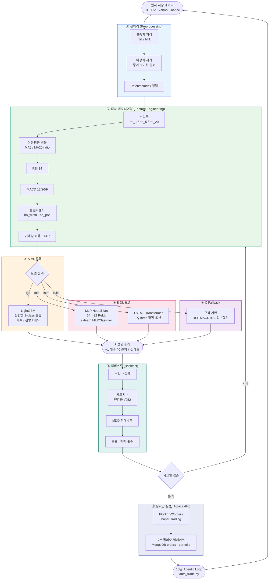

---

## 아키텍처

```
Browser
  │
  ▼
FastAPI (Uvicorn)
  ├── /api/auth/*         → MongoDB (motor)
  ├── /api/chat           → ReAct Agent → SQLite + Qdrant RAG
  ├── /api/stocks/*       → Yahoo Finance API (httpx)
  ├── /api/portfolio/*    → SQLite (aiosqlite)
  ├── /api/orders/*       → SQLite + 포트폴리오 동기화
  ├── /api/crawl/*        → GitHub API + Qdrant upsert
  ├── /api/quant/*        → Yahoo Finance + 기술지표 계산
  └── /api/admin/*        → 관리자 전용 초기화
  │
  ├── Redis ──── 세션 (fin_session:{uuid})
  ├── MongoDB ── users collection
  ├── SQLite ─── 10개 테이블
  │               personal_cb_stats, corporate_cb_stats,
  │               bank_products, fund_products, chats,
  │               portfolio, orders, broker_settings,
  │               crawled_docs, audit_events
  ├── Qdrant ─── fin_chunks collection (크롤링 문서)
  └── Ollama ─── llama3.1 (chat) + nomic-embed-text (embed)
```

---

## 로컬 실행 가이드

### 사전 요구사항
- Docker Desktop + Docker Compose v2
- Python 3.12 (로컬 개발 시)

### 1. 인프라 기동

```bash
# Ollama 모델 포함 전체 기동
docker compose up -d

# 모델 준비 대기 (약 1~5분)
docker compose logs -f model-pull
```

### 2. Python 앱 로컬 실행

```bash
# 가상환경
python -m venv .venv
source .venv/bin/activate          # Windows: .venv\Scripts\activate

pip install -r requirements.txt

# 환경변수
cp .env.example .env.dev

# DB 초기화 + CSV 인제스트
python -m app.services.financial_ingest

# 앱 실행
uvicorn app.main:app --reload --port 8000
```

### 3. Docker 전체 실행

```bash
docker compose up -d --build

# CSV 인제스트 (최초 1회)
docker compose run --rm ingest
```

브라우저: `http://localhost:8000`

---

## 환경변수

`.env.example` 참고. 핵심 변수:

| 변수 | 기본값 | 설명 |
|---|---|---|
| `OLLAMA_BASE_URL` | `http://127.0.0.1:11434` | Ollama 서버 주소 |
| `LLM_MODEL` | `llama3.1` | 채팅 모델 |
| `EMBED_MODEL` | `nomic-embed-text` | 임베딩 모델 |
| `MONGO_URI` | — | MongoDB 연결 문자열 |
| `REDIS_URL` | `redis://localhost:6379` | Redis 연결 문자열 |
| `SQLITE_PATH` | `./data/app.db` | SQLite 파일 경로 |
| `DATA_DIR` | `./data` | CSV 파일 루트 디렉토리 |
| `QDRANT_URL` | `http://localhost:6333` | Qdrant 서버 주소 |
| `QDRANT_COLLECTION` | `fin_chunks` | Qdrant 컬렉션명 |
| `GITHUB_TOKEN` | — | GitHub API rate limit 완화 |

---

## AWS 이관 가이드

### 권장 아키텍처

```
Internet
    │
    ▼
Route 53 → CloudFront (정적 자산 캐싱)
    │
    ▼
ALB (HTTPS, ACM 인증서)
    │
    ▼
ECS Fargate (fin-ai-app)
  ├── Task: FastAPI + Uvicorn
  ├── ECR: Docker 이미지
  └── EFS: data/ 볼륨 (SQLite, CSV)
    │
    ├── DocumentDB (MongoDB 호환) or Atlas
    ├── ElastiCache for Redis (Serverless 또는 r7g.large)
    ├── Ollama on EC2 (G4dn / G5 GPU 인스턴스)
    │     └── EFS 마운트: /root/.ollama
    └── Qdrant (아래 섹션 참고)
```

### ECS Fargate 태스크 정의 요점

```json
{
  "cpu": "1024",
  "memory": "2048",
  "portMappings": [{"containerPort": 8000}],
  "environment": [
    {"name": "OLLAMA_BASE_URL", "value": "http://<ollama-ec2-private-ip>:11434"},
    {"name": "QDRANT_URL",      "value": "http://<qdrant-ec2-private-ip>:6333"}
  ],
  "secrets": [
    {"name": "MONGO_URI",   "valueFrom": "arn:aws:secretsmanager:..."},
    {"name": "REDIS_URL",   "valueFrom": "arn:aws:secretsmanager:..."}
  ]
}
```

### CI/CD (GitHub Actions 예시)

```yaml
- name: Build & push to ECR
  run: |
    docker build -t $ECR_REPO:$GITHUB_SHA .
    docker push $ECR_REPO:$GITHUB_SHA
- name: Deploy to ECS
  run: aws ecs update-service --cluster fin-ai --service app --force-new-deployment
```

---

## Qdrant 구성 제안

### 옵션 비교

| 방식 | 비용 | 관리 | 권장 케이스 |
|---|---|---|---|
| **EC2 자가 호스팅** | EC2 비용만 | 직접 | 데이터 외부 전송 불가 / 비용 최적화 |
| **Qdrant Cloud** | 무료 1GB ~ 유료 | 관리형 | 빠른 PoC / 소규모 |
| **EKS on EC2** | 중간 | K8s 관리 | 대규모 고가용성 |

### EC2 자가 호스팅 (권장 시작점)

```bash
# r7g.large (ARM, 16GB RAM) 또는 m7i.large
docker run -d \
  -p 6333:6333 -p 6334:6334 \
  -v /data/qdrant:/qdrant/storage \
  qdrant/qdrant:latest
```

### 컬렉션 설계

```python
# fin_chunks – 크롤링 문서 RAG
VectorParams(size=768, distance=Distance.COSINE)
# payload 필드: source_url, chunk_index, doc_type, crawled_at

# 권장 인덱스
create_payload_index("fin_chunks", "doc_type", PayloadSchemaType.KEYWORD)
create_payload_index("fin_chunks", "crawled_at", PayloadSchemaType.DATETIME)
```

### 스케일링 시 고려사항

- **Qdrant Cluster 모드**: shard 수 = (총 벡터 수 / 200만) × replication factor
- **메모리**: 768차원 float32 × 벡터 수 × 1.5 (HNSW 오버헤드)
- **스냅샷 백업**: S3에 주기적 스냅샷 (`POST /collections/{name}/snapshots`)

---

## Qdrant 데이터 공유 방법

### Docker 이미지만으로는 데이터가 공유되지 않는 이유

이 프로젝트의 Qdrant 컨테이너는 **named volume**을 사용합니다 (`docker-compose.yml`):

```yaml
qdrant:
  volumes:
    - qdrant_data:/qdrant/storage   # named volume
```

Named volume은 Docker 이미지 레이어 **외부**에 존재합니다.  
따라서 `docker push` / `docker pull`로 이미지만 공유하면 크롤링·인제스트로 적재한 벡터 데이터는 전달되지 않습니다.  
데이터를 함께 전달하려면 아래 세 가지 방법 중 하나를 선택하세요.

---

### 방법 1 — Volume tarball 추출 (권장)

가장 간단한 방법으로, volume 전체를 압축 파일 하나로 내보냅니다.

**① 내보내기 (공유하는 쪽)**

```bash
# Qdrant 컨테이너를 먼저 중지해 파일 정합성 보장
docker compose stop qdrant

docker run --rm \
  -v qdrant_data:/qdrant/storage \
  -v $(pwd):/backup \
  busybox tar czf /backup/qdrant_data.tar.gz -C /qdrant/storage .

# 완료 후 재기동
docker compose start qdrant
```

생성된 `qdrant_data.tar.gz` 파일을 상대방에게 전달합니다.

**② 불러오기 (받는 쪽)**

```bash
# 1. Named volume 생성
docker volume create qdrant_data

# 2. tarball 압축 해제 후 volume에 적재
docker run --rm \
  -v qdrant_data:/qdrant/storage \
  -v $(pwd):/backup \
  busybox tar xzf /backup/qdrant_data.tar.gz -C /qdrant/storage

# 3. 전체 스택 기동
docker compose up -d
```

> **주의**: `docker compose up -d` 실행 전에 volume을 복원해야 Qdrant가 기동 시 데이터를 올바르게 인식합니다.

---

### 방법 2 — Qdrant Snapshot API (공식 방식)

Qdrant가 내장한 스냅샷 기능으로, **컬렉션 단위**로 선택적 공유가 가능합니다.

**① 스냅샷 생성 및 다운로드 (공유하는 쪽)**

```bash
# 스냅샷 생성 (컬렉션명: fin_chunks)
curl -X POST http://localhost:6333/collections/fin_chunks/snapshots

# 생성된 스냅샷 목록 확인
curl http://localhost:6333/collections/fin_chunks/snapshots
# 응답 예시: {"result":[{"name":"fin_chunks-123456789.snapshot", ...}]}

# 스냅샷 파일 다운로드
curl -O http://localhost:6333/collections/fin_chunks/snapshots/fin_chunks-123456789.snapshot
```

**② 복원 (받는 쪽)**

```bash
# Qdrant 기동 후, 스냅샷을 업로드하여 컬렉션 복원
curl -X POST 'http://localhost:6333/collections/fin_chunks/snapshots/upload?priority=snapshot' \
  -H 'Content-Type: multipart/form-data' \
  -F 'snapshot=@fin_chunks-123456789.snapshot'
```

컬렉션이 없으면 자동 생성되고, 이미 있으면 스냅샷 내용으로 덮어씁니다.

> **여러 컬렉션이 있는 경우** 각 컬렉션마다 위 명령을 반복하거나,  
> 전체 스토리지 수준 백업은 방법 1(tarball)을 사용하세요.

---

### 방법 3 — 이미지에 데이터 굽기 (비권장)

```dockerfile
FROM qdrant/qdrant:latest
COPY ./qdrant_storage /qdrant/storage
```

배포는 단순해지나, 데이터가 클수록 이미지가 비대해지고  
데이터 업데이트 시마다 이미지를 다시 빌드·푸시해야 하므로 권장하지 않습니다.

---

### 방법 비교

| 방법 | 공유 단위 | 장점 | 단점 |
|---|---|---|---|
| **Volume tarball** | 전체 storage | 명령 2개로 완전 복원, 추가 도구 불필요 | 컨테이너 중지 필요, 파일이 클 수 있음 |
| **Snapshot API** | 컬렉션 단위 | Qdrant 공식, 선택적·점진적 공유 가능 | 컬렉션이 여러 개면 반복 작업 필요 |
| **이미지에 굽기** | 이미지 전체 | 이미지 하나로 배포 완결 | 이미지 비대화, 데이터 갱신 불편 |

---

## 주요 화면

> Playwright로 캡처한 주요 화면입니다 (한글 폰트 적용, API Mock 기반).

### 1. 메인 랜딩
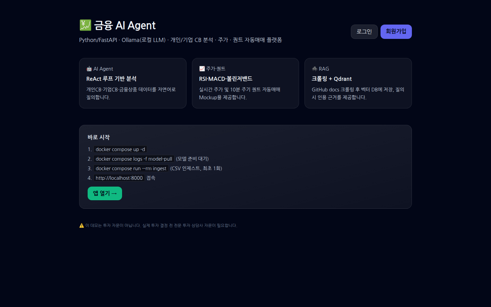

### 2. 회원가입
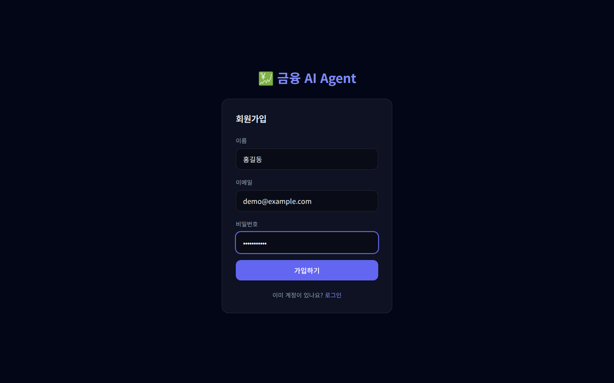

### 3. 로그인
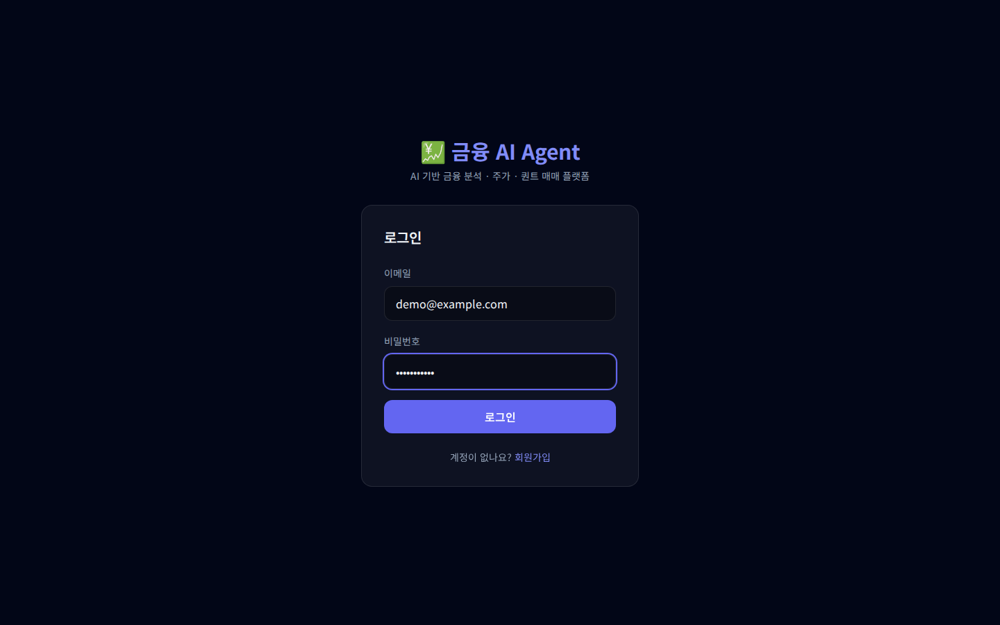

### 4. AI 금융 채팅 (ReAct Agent 답변)
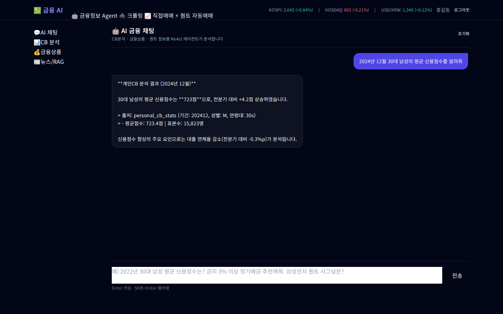

### 5. CB 분석 대시보드
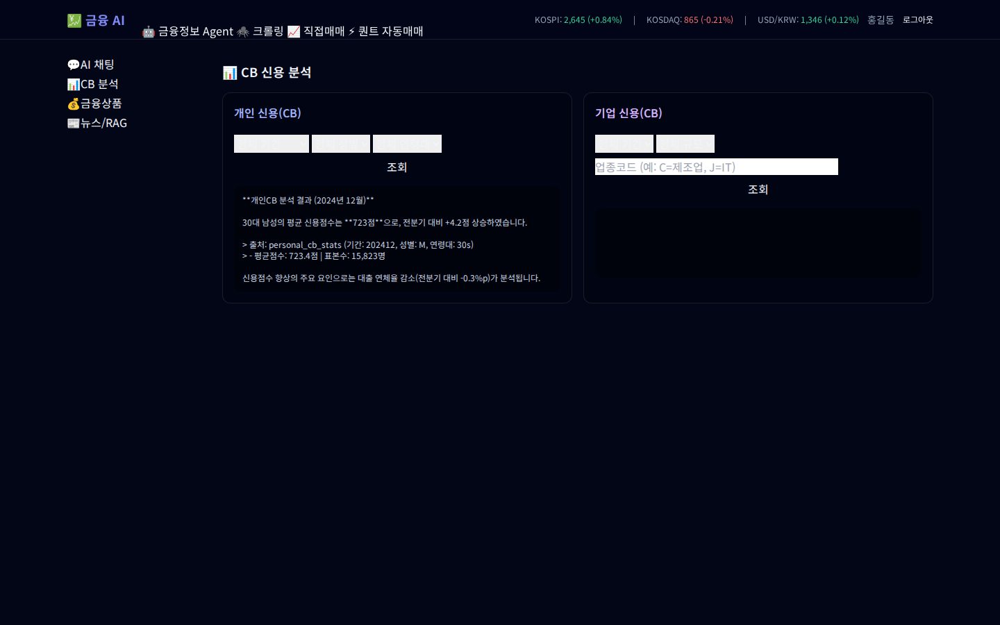

### 6. 크롤링 현황 (GitHub docs → Qdrant RAG)
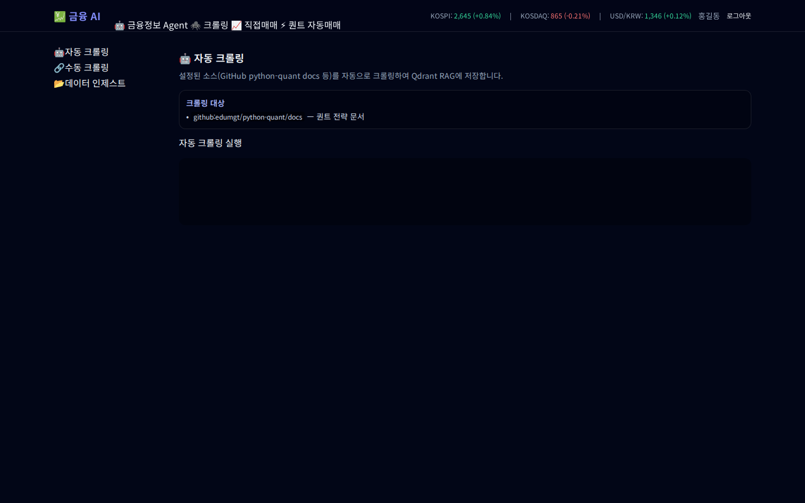

### 7. 주가 캔들차트 (TradingView)
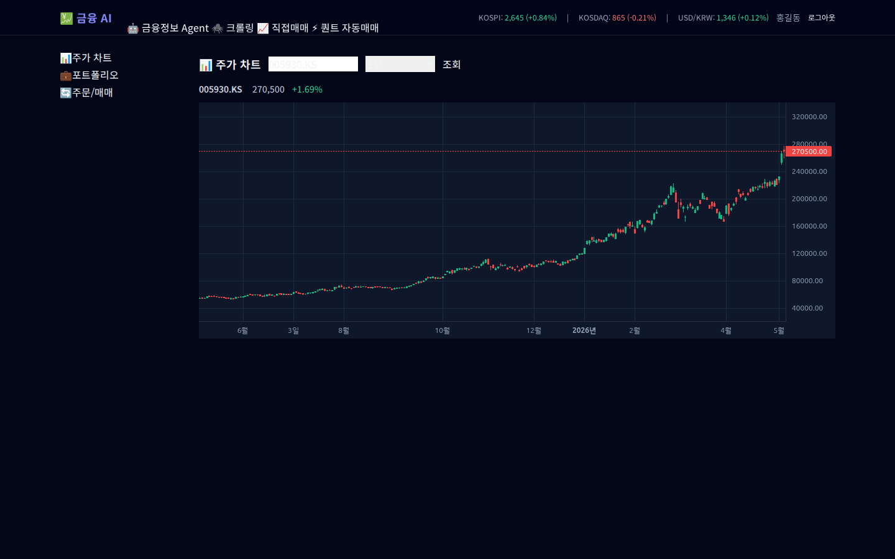

### 8. 포트폴리오 관리
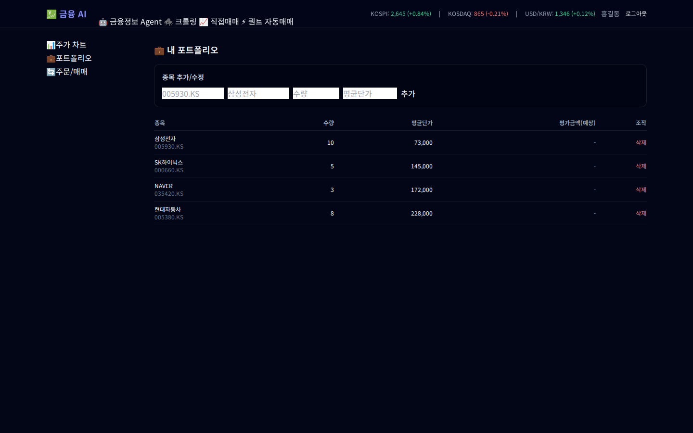

### 9. 주문/매매 내역
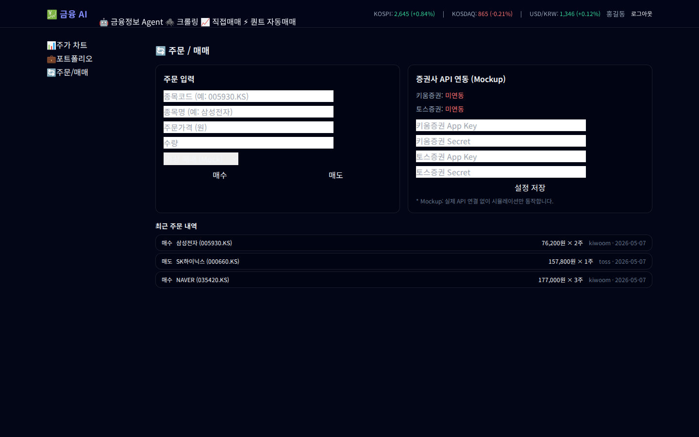

### 10. 퀀트 시그널 대시보드 (RSI·SMA·볼린저)
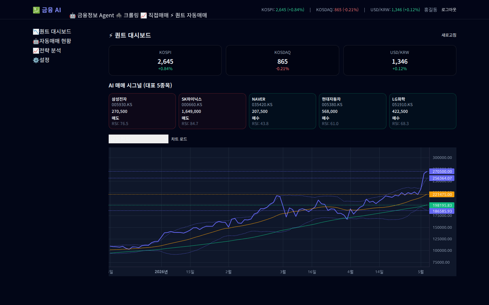

### 11. 10분 자동매매 Agentic AI 로그
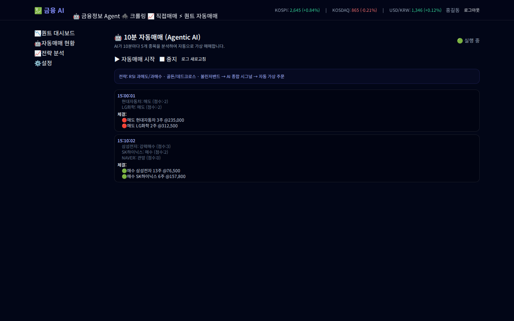

### 12. 퀀트 백테스트 (10년 데이터)
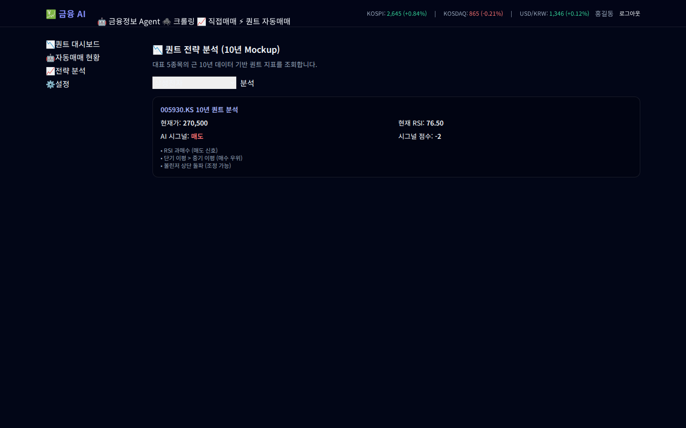

### 13. GNB/LNB 구조 + 푸터 (에듀엠지티)
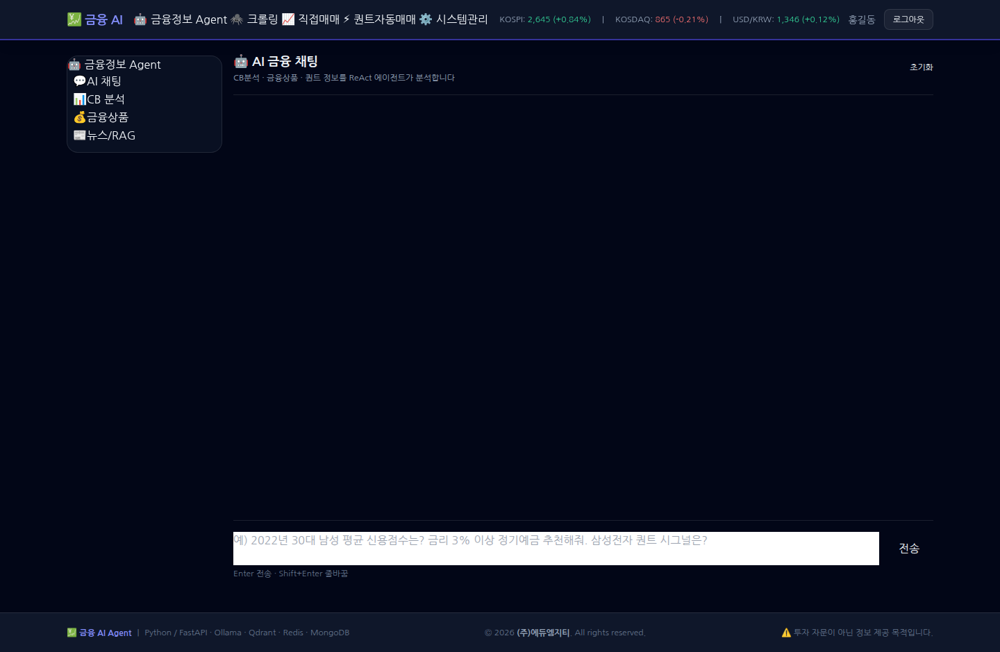

### 14. 시스템 관리 대시보드 (CPU·메모리·Docker 컨테이너)
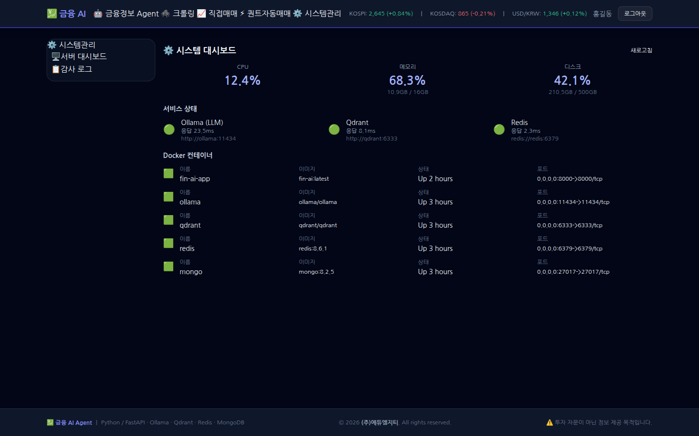

### 15. 증권사 Open API 설정 (KIS/eBest)
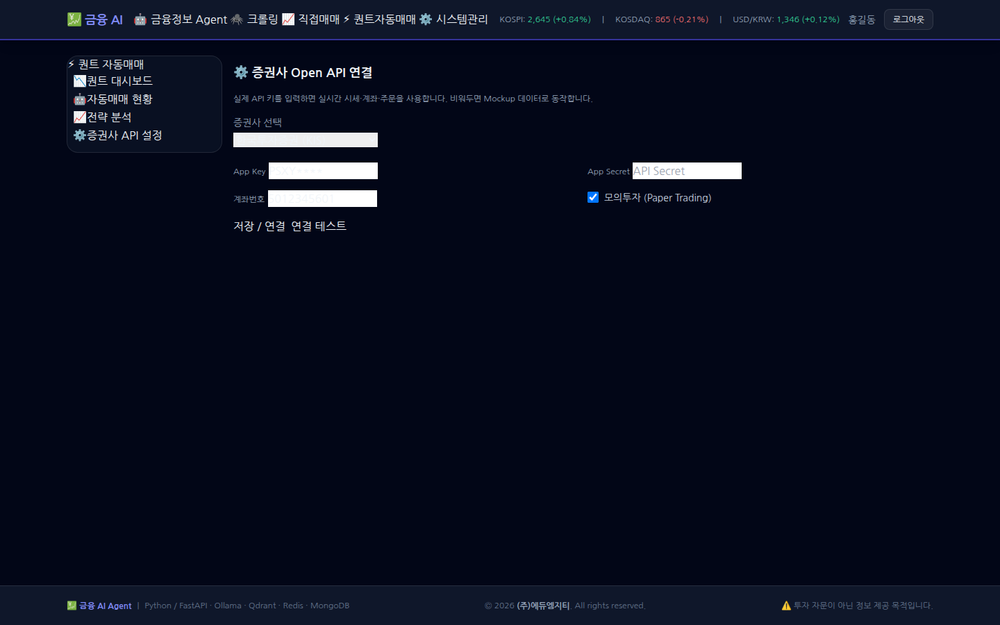

---

Python 전처리 및 시각화	
- Pandas, Numpy를 이용한 데이터 전처리 
- Matplolib, Seaborn 등의 도구를 활용한 데이터 시각화 
- 다양한 차트의 종류 및 데이터 형태 별 차트 활용에 대한 내용 학습

AI 및 퀀트 모델링을 위한 기초 수학-통계	
- 기초 통계량(평균, 분산, 중위값, 사분위수, 표준편차 등) 개념 및 값 구하기 
- 통계 검정의 개념 및 검정 통계량 산출, 해석(p-value, 유의수준 등) 
- 선형대수에 대한 기초 이해(스칼라, 벡터, 행렬에 대한 이해) 
- Numpy를 활용한 행렬 연산 실습

시계열 데이터 분석	
- 시계열 데이터의 특성 이해하기 
- 시계열 데이터의 특성에 맞는 데이터 전처리 
- 시간의 흐름에 따른 데이터의 변화 양상 시각화하여 파악하기 
- 통계에 기반한 시계열 데이터 분석 및 활용 데이터 분석 및 활용

퀀트를 위한 머신러닝과 딥러닝	
- 머신러닝(회귀, SVM, Random Forest, Ensemble 등)과 딥러닝(RNN, CNN, LSTM, Transformer) 주요 모델 학습하기 
- 하이퍼 파라미터 튜닝, 교차 검증, 성능 확인 등 모델링의 주요 개념 이해하기 
- 클러스터링을 통한 군집화 및 의미 해석하기 
- 시계열에서 주로 활용되는 모델에 대한 학습(Transformer를 접목한 최신 시계열 분석 모델 학습)	

투자분석 기초 방법론	
- 매크로 분석: 경제지표 분석(금리, 물가, 유가 등 주요 지표 보는 법 ), 거시경제상황 분석 실습 
- 산업 분석: 산업 경쟁력 분석(산업경쟁력 개념/분석모형, 산업별 분석방법), 산업 분석 실습 
- 기본적 분석: 재무제표분석 (손익계산서/대차대조표/현금흐름표), 기업가치분석(상대가치평가 밸류에이션(멀티플), 절대가치평가 밸류에이션 (DCF, EVA, FCF 등)), 분석기업선정 및 밸류에이션 실습 
- 기술적 분석: 추세 분석(지지선과 저항선, 이동평균선, 갭 반전, 되돌림 분석 등), 패턴 분석, 캔들 차트 분석, 지표 분석, 앨리어트파동이론, 분석기업선정 및 기술적 분석

퀀트를 위한 금융 필수 지식	
- 금융상품 이해: 주식/ETF 상품(주식/ETF 개요 및 운용 전략), 채권 상품(채권 개요 및 운용 전략), 파생상품(파생상품 개요 및 운용 전략) 
- 자산배분방법론: 포트폴리오 이론(개요 및 성과분석, 리스크 지표), 자산배분 모델(평균분산, 블랙리터만, Risk-Parity 모델 설명), 사례 분석

데이터 활용 퀀트 모델링	
- 백테스트로 나오는 성과 지표 분석(MDD, Sharp ratio 등) 및 개선방향 논의 
- 주식 시장의 계절성 분석(연말 랠리, 월별 효과, 요일 효과) 
- 알고리즘 트레이딩 &amp; 자동매매 기초(트레이딩뷰 PineScript)

주가 지수 데이터 활용 머신러닝 -딥러닝 프로젝트	
- 국내 증시 데이터를 활용한 시계열 머신러닝-딥러닝 프로젝트 
- 네이버 주식 웹 페이지 크롤링을 통한 주가 정보 수집 
- 주가 데이터 클러스터링을 통한 주식 항목 군집화 및 해석 
- 다양한 지표를 투입한 머신러닝-딥러닝 모델링을 통해 주가 변동 방향성을 직접 예측해보고 검증

나만의 로보 어드바이저 개발 및 성과 검증 프로젝트	
- AI 기반의 자동화 로보 어드바이저 모델 개발 
- 패턴 인식 기법을 활용한 주식 시장 예측 프로젝트 
- 자산배분모델을 활용한 포트폴리오 최적화, 주식 스크리닝을 통한 종목 선정 등 직접 수행 
- 구축한 퀀트 모델의 결과를 해석해보고 자체적으로 모의 투자 의사결정 진행

나만의 투자 인디케이터 개발 및 성과 검증 프로젝트	
- 기본적인 인디케이터(MA, RSI등)로 전략 설계 
- 커스텀 인디케이터 개발 
- 트레이딩뷰 플랫폼으로 성과 확인 및 코딩 실습(PineScript) 
- 파이썬 프로그래밍을 통한 성과 검증 
- 증권사 연동(API 활용)을 통한 자동화 모델 구현

